# Индивидуальное домашнее задание №3
## Евсюков Александр  <br/> Группа БПИ224  <br/> Вариант 12
## _Условие:_ 
Разработать программу, определяющую минимальный и максимальный (по числовому значению) символ в заданной ASCII–строке. Вывести в файл символ и его числовой код.

## _Решение:_
Для решения задания была разработана подпрограмма `find_min_max_char`, которая принимает на вход строку, ранее прочитанную из файла, и возвращает два значения в регистрах `a1 и a2 (min и max соответственно)`. Далее для вывода полученные значения отправляются в подпрограмму `str_min_max`, где создается массив и поссимвольно заполняется. Для преобразования числового значения символа в строку также разработана подпрограмма `int_to_string`. Затем эта строка передается в подпрограмму для записи в файл, а также пользователю предлагается вывести результат в консоль.

_Результат работы программы:_

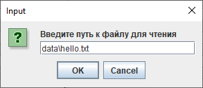

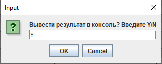
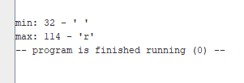
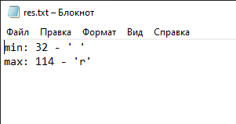

## _Тесты:_ 
* Тест 1
    <br/>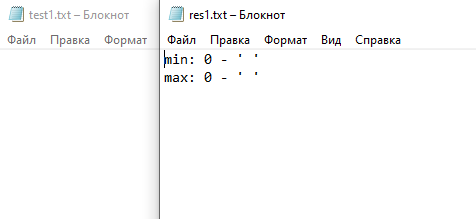

* Тест 2
    <br/>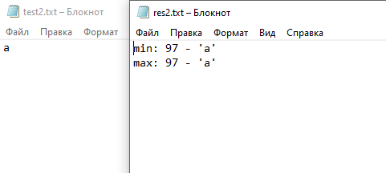

* Тест 3
    <br/>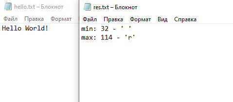

* Тест 4
    <br/>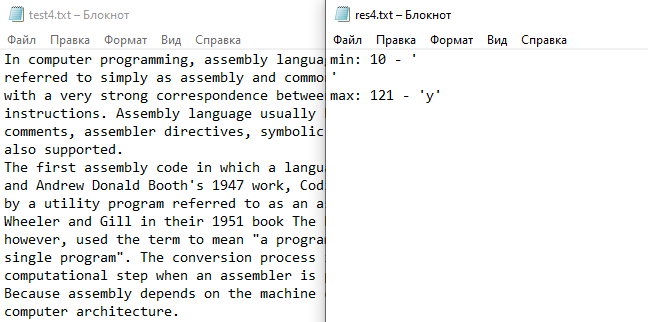

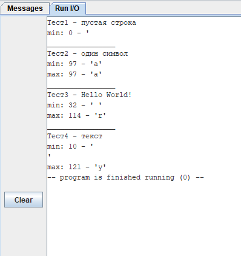

## _Текст программы:_
В качестве примера текста программы ниже приведен текст main и подпрограмма поиска минимального и максимального символа, остальные подпрограммы и библиотека макросов лежат в репозитории. 
main:
```
.include "macro-syscalls.m"

.global main

_main:_
.eqv	FILE_NAME_SIZE 256		# Размер буфера для имени файла
.data
	.align 2
	file_name:		.space		FILE_NAME_SIZE	# Буфер для имени файла
	file_name_out:	.space		FILE_NAME_SIZE	# Буфер для имени файла вывода
.text
	InputDialogString("Введите путь к файлу для чтения", file_name, FILE_NAME_SIZE)
	read_file(file_name)
	
	find_min_max_char(a1)	    # Вызываем подпрограмму для поиска минимального и максимального элементов
					            # строка находится в регисре a1
					
	str_min_max(a1, a2)		    # Создаем строку ответ передавая минимальный и максимальный элемент
	mv	s10 a0			        # Сохраняем результат на будущее
	
	InputDialogString("Введите путь к файлу для записи", file_name_out, FILE_NAME_SIZE)
	write_file(file_name_out, a0)	# Записываем ответ в файл и передаем указатель на результат
	
	ask_to_user			        # Спрашиваем у пользователя хочет ли он вывести результат в консоль
	mv	a0 s10			        # Восстанавливаем адресс строки в a0
	li	a7 4		
	ecall
	
without_console:
	exit				        # Завершаем программу
```

_find_min_max_char:_

```
.include "macro-syscalls.m"
# s1 - min
# s2 - max
.global find_min_max_char

find_min_max_char:

.data	
	.align 2
	str_min:	.word 
	str_max:	.word
.text	
	push(ra)
	
	mv	t0 a0		                #Передаем строку из файла
	
	# Предцикловая загрузка символов для отлова ошибок
	lb	t1 (t0)
	addi	t0 t0 1
	beqz 	t1 error			    # Пустая строка
	lb	t2 (t0)
	addi	t0 t0 1
	beqz 	t2 error2			    # Строка с одним символом
	blt 	t1, t2, first_min 		# if t1 < t2
	bgt 	t1, t2, second_min 		# if t1 > t2
back:

loop:
	lb	t1 (t0)	
	beqz 	t1 exit
	blt 	t1, s1, new_min 		# if t1 < s1
	bgt 	t1, s2, new_max 		# if t1 > s2
	back_loop:
	addi	t0 t0 1
	j	loop
	
exit:	
	mv	a1 s1			# Возвращаем min в a2
	mv	a2 s2			# Возвращаем max в a3
	pop(ra)
	ret		

new_min:
	mv	s1 t1
	j	back_loop
new_max:	
	mv	s2 t1
	j	back_loop
			
first_min:
	mv	s1 t1
	mv	s2 t2
	j	back
	
second_min:
	mv	s1 t2
	mv	s2 t1
	j	back
				
error2:
	# Строка с одним символом
	# Возвращаем этот символ, как минимальный и максимальный
	mv	a1 t1			
	mv	a2 t1
	pop(ra)
	ret			

error:
	# Пустая строка
	# Возвращаем null
	li	a1 0
	li	a2 0
	pop(ra)
	ret
```

## _Дополнительная информация:_
* В файле `main` все вызовы подпрограмм обернуты в макросы
* Все переменные хранятся в памяти, чтобы не занимать регистры 
* Передача переменных происходит через регистры `a`, согласно общепринятому соглашению.
* При желании пользователь может вывести результат в консоль
* При вызове подпрограммы происходит передача необходимых переменных. Данная функция реализована с целью создания программы, которая будет способна работать с разными данными, в том числе c пользовательскими переменными
* Взаимодействие с пользователем организовано через `диалоговое окно`
* Если пользователь вводит неизвестные значения, он получает сообщения об ошибке
    <br/>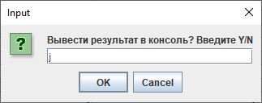 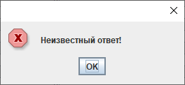
    <br/>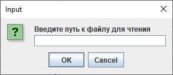 
    <br/>
* Дополнительная тестовая программа и файлы к ней расположены в папке `test_program`
* Для корректной работы программы необходимо включить следующие настройки: 
	<br/>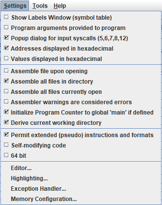